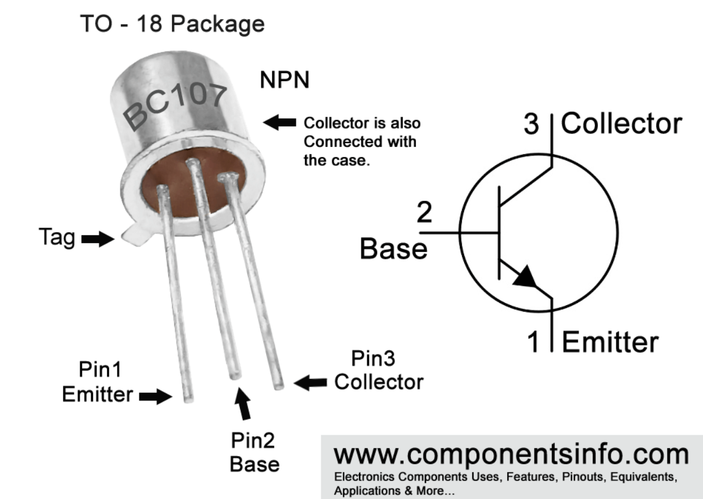

# Server Temperature Control Using Raspberry Pi

In this project, we aim to create a temperature controlling system, which uses a Raspberry Pi to control the fan speed, according to the server's temperature. 

## Tools

- Raspberry Pi 3B
- AM2302 (DHT11) Temperature Sensor (Uses one-wire protocol)
- OpenBMC Operating System
- A 2-pin 12V DC Fan
- BC107 Transistor
- USB-UART Converter


## Implementation Details

### Compiling and Using OpenBMC
<div dir="rtl">
1. شرح پروژه

 OpenBMC یک بورد مدیریت سیستم (Baseboard Management Controller) متن‌باز است که برای نظارت و مدیریت سخت‌افزارهای سروری و سیستم‌های جاسازی‌شده استفاده می‌شود. استفاده از Raspberry Pi 3 به عنوان بستر سخت‌افزاری به دلیل هزینه پایین و قابلیت انعطاف در پروژه‌های تحقیقاتی و آموزشی، انتخاب مناسبی می‌باشد.

2. مراحل انجام پروژه

الف) آماده‌سازی محیط

1. نصب بسته‌های مورد نیاز:  
     ابتدا لازم است تا بسته‌های پیش‌نیاز جهت ساخت محیط Yocto و OpenBMC نصب شود. برای این کار از دستورات زیر استفاده می‌شود:  

   ```bash
   sudo apt-get install git-core diffstat unzip texinfo gcc-multilib build-essential chrpath wget
   sudo apt-get install libc6-dev-i386 python3-pip python3-pexpect xterm
   sudo apt-get install debhelper screen setools
   ```
   
ب) کلون کردن مخازن مورد نیاز

2. دریافت سورس OpenBMC:  
   با اجرای دستور زیر کدهای منبع OpenBMC دریافت می‌شوند:  
   ```bash
   git clone https://github.com/openbmc/openbmc.git
   cd openbmc
   ```
   
3. دریافت Yocto poky:  
   مخزن Yocto که پایه ساخت سیستم عامل است را کلون کنید:  
   ```bash
   git clone git://git.yoctoproject.org/poky
   cd poky
   ```

پ) تنظیم محیط ساخت (Build Environment)

4. راه‌اندازی محیط Yocto:  
   با اجرای دستور زیر محیط ساخت برای Raspberry Pi 3 راه‌اندازی می‌شود:
   ```bash
   source oe-init-build-env rpi-build
   ```
ت) افزودن لایه‌های مورد نیاز

5. کلون کردن لایه‌های اضافی:  
   لایه‌های ضروری برای پشتیبانی از Raspberry Pi و بسته‌های پایتون را دریافت نمایید:  
   ```bash
   git clone git://git.yoctoproject.org/meta-raspberrypi ../meta-raspberrypi
   git clone git://git.openembedded.org/meta-openembedded ../meta-openembedded
   ```
   
6. تنظیم فایل bblayers.conf:  
   در این فایل مسیرهای لایه‌های مختلف (مانند:
   - مسیر لایه اصلی Yocto (meta)
   - مسیر meta-poky
   - مسیر meta-raspberrypi  
   ) به درستی درج می‌شود تا Yocto بتواند پکیج‌ها و تنظیمات مربوطه را شناسایی کند.


   در این فایل مسیرهای لایه‌های مختلف به شرح زیر درج می‌شود. مطمئن شوید مسیرها مطابق ساختار دایرکتوری شما باشند:  

   ```bash
   #conf/bblayers.conf
   POKY_BBLAYERS_CONF_VERSION = "2"

   BBPATH = "${TOPDIR}"
   BBFILES ?= ""

   BBLAYERS ?= " \
     /home/ali/openbmc/poky/meta \
     /home/ali/openbmc/poky/meta-poky \
     /home/ali/openbmc/poky/meta-yocto-bsp \
     /home/ali/openbmc/meta-raspberrypi \
     /home/ali/openbmc/meta-openembedded/meta-python \
     /home/ali/openbmc/meta-openembedded/meta-oe \
   "
   ```
ث) پیکربندی نهایی و ساخت تصویر

7. تنظیمات پیکربندی: 
   در فایل `conf/local.conf` تغییراتی به‌منظور تعیین پلتفرم Raspberry Pi 3 اعمال می‌شود:
   - تنظیم متغیر:
     ```
     MACHINE = "raspberrypi3"
     ```
   - پذیرش مجوز مربوط به synaptics-killswitch:
     ```
     LICENSE_FLAGS_ACCEPTED = "synaptics-killswitch"
     ```
   ```bash
   #conf/local.conf
   MACHINE = "raspberrypi3"
   DISTRO = "poky"
   
   IMAGE_INSTALL += " \
       coreutils \
       python3 \
       python3-pip \
       python3-setuptools \
       python3-wheel \
       python3-dev \
       python3-venv \
       gcc \
       g++ \
       make \
       libgcc \
       libstdc++ \
       nano \
   "
   
   LICENSE_FLAGS_ACCEPTED = "synaptics-killswitch"
   ```

8. ساخت تصویر سیستم:
   با استفاده از دستور bitbake، یک تصویر ساخته می‌شود:
   ```bash
   bitbake core-image-full-cmdline
   ```

ج) انتقال تصویر به SD Card و راه‌اندازی

9. نصب تصویر بر روی SD Card:
   پس از اتمام فرایند ساخت، تصویر ساخته شده در مسیر مشخص (مثلاً `/home/ali/openbmc/poky/rpi-build/tmp/deploy/images/raspberrypi3`) قرار دارد. برای انتقال تصویر به SD Card از دستور dd به صورت زیر استفاده می‌شود:
   ```bash
   sudo dd if=/home/ali/openbmc/poky/rpi-build/tmp/deploy/images/raspberrypi3 of=/dev/sdb1 bs=4M status=progress
   ```
   (توجه: مطمئن شوید که مسیر دستگاه مقصد (/dev/sdb1) صحیح انتخاب شده تا از نوشتن تصادفی روی دیسک‌های دیگر جلوگیری شود.)

10. راه‌اندازی Raspberry Pi 3:
    پس از انتقال موفقیت‌آمیز تصویر به SD Card، این کارت را در Raspberry Pi 3 قرار داده و سیستم را روشن کنید. در صورت عدم بروز خطا، Raspberry Pi 3 با محیط OpenBMC بوت شده و آماده استفاده خواهد بود.


3. چالش‌های مواجه شده

- مدیریت وابستگی‌ها و نصب پیش‌نیازها:
  نصب و هماهنگ‌سازی کتابخانه‌های لازم (از جمله ابزارهای ساخت Yocto) ممکن است به دلیل نسخه‌های مختلف توزیع‌های لینوکسی با چالش‌هایی مواجه شود.

- پیکربندی فایل‌های build:
  تنظیم دقیق فایل‌های `bblayers.conf` و `local.conf` برای شناسایی صحیح لایه‌ها و تعیین پلتفرم (MACHINE) از مهم‌ترین مراحل است؛ هرگونه اشتباه در این فایل‌ها منجر به خطاهای ساخت می‌شود.

- مشکلات در فرایند ساخت:
  استفاده از bitbake ممکن است خطاهایی ناشی از ناسازگاری یا تنظیمات ناقص به همراه داشته باشد. بررسی لاگ‌های ساخت برای رفع اشکال الزامی است.

- انتقال تصویر به SD Card:
  استفاده از دستور dd نیازمند دقت بالایی است؛ اشتباه در انتخاب دستگاه مقصد می‌تواند منجر به از دست رفتن اطلاعات روی دیسک‌های دیگر شود.

4. توضیحات درباره کد و دستورات

- دستور git clone:
  این دستور برای دریافت کدهای منبع از مخازن GitHub و مخازن Yocto استفاده می‌شود. هر یک از این مخازن شامل بخش‌های مهم پروژه (OpenBMC، لایه‌های Yocto، پیکربندی‌های مربوط به Raspberry Pi) هستند.

- اجرای source oe-init-build-env:
  این دستور محیط ساخت Yocto را راه‌اندازی می‌کند و متغیرهای محیطی لازم برای اجرای دستور bitbake تنظیم می‌شود.

- تنظیمات در bblayers.conf و local.conf:  
  در فایل bblayers.conf مسیرهای لایه‌های مورد نیاز برای ساخت به Yocto معرفی می‌شود. در فایل local.conf نیز تنظیمات مربوط به پلتفرم هدف (مانند MACHINE) و پذیرش مجوزهای لازم انجام می‌شود.

- دستور bitbake:  
  با اجرای این دستور (به عنوان مثال `bitbake core-image-minimal`) فرایند ساخت یک تصویر سیستم عامل مینیمال آغاز می‌شود که شامل اجزای اصلی OpenBMC است.

- دستور dd: 
  این دستور برای انتقال تصویر ساخته شده به SD Card استفاده می‌شود. پارامترهای آن (bs=4M و status=progress) کمک می‌کنند تا فرایند انتقال با سرعت بالا و با نمایش وضعیت پیشرفت انجام شود.


5. تفسیر نتایج و نتیجه‌گیری

پس از اجرای موفق مراحل بالا، نتیجه مورد انتظار به شرح زیر است:

- بوت موفق سیستم:
  Raspberry Pi 3 پس از قرار دادن SD Card و روشن شدن، باید به درستی با محیط OpenBMC بوت شده و صفحه‌ی مدیریت یا پیام‌های بوت را نمایش دهد.

- بررسی لاگ‌ها: 
  مشاهده لاگ‌های سیستم می‌تواند نشان دهد که مراحل ساخت و انتقال تصویر بدون خطا انجام شده و سیستم به درستی راه‌اندازی شده است.

- رفع چالش‌ها:
  در صورت بروز هرگونه خطا در هر مرحله (ساخت، پیکربندی یا انتقال تصویر) با بررسی دقیق لاگ‌ها و مستندات مرتبط، می‌توان اقدامات اصلاحی لازم را انجام داد.

- کاربرد پروژه:
  این پروژه به عنوان یک نمونه کاربردی از استفاده از محیط Yocto برای ساخت سیستم‌های جاسازی‌شده و بهره‌گیری از OpenBMC برای مدیریت سخت‌افزار، قابلیت اطمینان و انعطاف‌پذیری را نشان می‌دهد.
</div>

#### Some notes on starting and using Raspberry Pi3 Model B with OpenBMC installed
Although the default username and password for OpenBMC are `root` and `0penBmc`, we weren't able to login with these credentials. Instead, we edited the `/etc/shadow` file so that the root does not have any password. 

### Interacting with Raspberry Pi 3 B using your system

A challenging part of the project was to connect Raspberry Pi to your PC and interact it using tools such as `PuTTY` (Windows) or `screen` (linux). Here is the descriptions for `PuTTY`, but it is not so different for other terminal emulators

Wires connection:
- Get a uart to usb converter.
- connect Rx of converter to Pin No. 8 of Rpi (Tx of Rpi)
- connect Tx of converter to Pin No. 10 of Rpi (Rx of Rpi)
- connect GND of converter to any GND of Rpi, for example Pin No. 6

Add these to config.txt of boot of rpi (in the memory card):
- `enable_uart=1`
- `dtoverlay=disable-bt`
- `core_freq=250`

Add this line somewhere in /etc/inittab:
```
T0:2345:respawn:/sbin/getty -L ttyAMA0 115200 vt100
```

also, cmdline.txt should be this:
```
console=ttyAMA0,115200 root=/dev/mmcblk0p2 rootfstype=ext4 fsck.repair=yes rootwait S
```

To connect the RPi to your pc, you can use PuTTY in windows or screen in linux.
First, turn off the rpi if it is on.
Then, connect the UART-USB converter to your PC.
Then using device manager in windows, find the COM# port corresponding to the converter (mine was COM11).
Then, connect to putty with the following configuration:


<p align="center">


</p>
Now, you can turn on the rpi. You can do it by plugging its power to one of the USB ports of your own computer. Now, you can use it!

### Turning an LED On and Off

The first step of using RPi is to use its GPIO pins to create a blinking LED. We have implemented the code for this purpose both in Python and C. However, there are some notes on using each of these programming languages:

- C: Although we have included gcc in the configuration files when building OpenBMC, the bash couldn't recognize `gcc`. Instead, you have to use another name for accessing gcc. The name is `arm-openbmc-linux-gnueabi-gcc`.
- Python: There are two popular libraries to work with GPIO in python: `gpiozero` and `RPi.GPIO`. We focused on using gpiozero.
We first tried to install this package when building OpenBMC, but it didn't work.
So, we built a virtual environment on some other machine (my own linux) and installed the necessary packages, and activated this env in raspberry pi.
Also note that `source env/bin/activate` does not work. I am not sure why, but an alternative way is to add the path to the libs directly to syspath at the beginning of the code. You can do this by adding these lines at the very beginning of your python code:

```python
import sys
sys.path.append('env/lib/python3.8/site-packages')
```

We also tried to use RPi.GPIO as well, but its module couldn't be loaded correctly.

#### Using C

```c
#include <stdio.h>
#include <stdlib.h>
#include <fcntl.h>
#include <sys/mman.h>
#include <unistd.h>

#define GPIO_BASE 0x3F200000 // Base address for Raspberry Pi 3 Model B GPIO
#define BLOCK_SIZE 4096
#define GPIO_SET *(gpio + 7)  // GPSET0 register (offset 0x1C)
#define GPIO_CLR *(gpio + 10) // GPCLR0 register (offset 0x28)

volatile unsigned *gpio; // Pointer to GPIO memory

void setup_io() {
    int mem_fd = open("/dev/mem", O_RDWR | O_SYNC);
    if (mem_fd < 0) {
        perror("Failed to open /dev/mem");
        exit(1);
    }

    gpio = (volatile unsigned *)mmap(NULL, BLOCK_SIZE, PROT_READ | PROT_WRITE, MAP_SHARED, mem_fd, GPIO_BASE);
    if (gpio == MAP_FAILED) {
        perror("mmap failed");
        close(mem_fd);
        exit(1);
    }

    close(mem_fd);
}

void set_pin_mode_output(int pin) {
    int gpio_offset = pin / 10;
    int gpio_bit = (pin % 10) * 3;
    *(gpio + gpio_offset) &= ~(7 << gpio_bit); // Clear bits
    *(gpio + gpio_offset) |= (1 << gpio_bit); // Set bits for output mode
}

int main() {
    setup_io();

    int gpio_pin = 18; // BCM pin number

    // Set GPIO pin as output
    set_pin_mode_output(gpio_pin);

    while (1) {
        // Write HIGH to the pin
        GPIO_SET = (1 << gpio_pin);
        printf("Pin set to HIGH\n");
        sleep(1); // Wait for 1 second

        // Write LOW to the pin
        GPIO_CLR = (1 << gpio_pin);
        printf("Pin set to LOW\n");
        sleep(1); // Wait for 1 second
    }

    return 0;
}
```

#### Using Python

```python
import sys
sys.path.append('env/lib/python3.8/site-packages')

from gpiozero import LED
from time import sleep


# Define the GPIO pin (BCM numbering)
led = LED(17)

while True:
    led.on()  # Set pin HIGH
    print("Pin set to HIGH")
    sleep(1)  # Wait for 1 second

    led.off()  # Set pin LOW
    print("Pin set to LOW")
    sleep(1)  # Wait for 1 second
```

### Reading Temperature from a DHT11 Temperature Sensor

First, we have to wire the sensor to RPi. Here is the pins names of the sensor and RPi pins:

<p align="center">


</p>

Here is the wiring we used:
- Sensor's VCC (pin1) -> RPi Physical pin 1 (top most pin on the left column)
- Sensor's Data (pin2) -> RPi Physical pin 7 (GPIO 4)
- Sensor's GND (pin4) -> RPi Physical pin 9 (GND)

Now, to read the temperature and humidity, we used the following code:

```python
import time
import board
import adafruit_dht

# Initialize DHT device, with data pin connected to board.D4 (GPIO4 on Pi)
# For an AM2302/DHT22 sensor:
dhtDevice = adafruit_dht.DHT22(board.D4)

while True:
    try:
        temperature_c = dhtDevice.temperature
        humidity = dhtDevice.humidity
        if humidity is not None and temperature_c is not None:
            print(f"Temp: {temperature_c:.1f} °C   Humidity: {humidity:.1f}%")
        else:
            print("Failed to retrieve data from the DHT sensor")
    except RuntimeError as error:
        # It's normal to get errors occasionally, sensor may be busy.
        print(f"Reading error: {error.args[0]}")
    time.sleep(2)
```

### Putting everything together (Actual Temperature Controller!)

#### Wirings and Circuits
We used a BC107 transistor as a low-side switch to be able to control the fan using RPi's GPIO. We also used a 12V DC power supply. Note that you can buy a cheap adaptor to convert 220 V AC to this desired electricity.

** Notes: BC107's collector current's capacity is around 100mA. So note that the used fan does not need a current higher than this value. We first used a fan which needed 250mA, and the transistor heated very much, so we used a smaller fan instead.

Here is the pins names of the BC107 transistor:

<p align="center">

</p>

Wirings:
- GPIO Pin -> 200Ω Resistor -> Base: We used GPIO23 to control the fan. The resistor is used to limit the current to the base of the transistor and protect the GPIO.
- Emitter -> GND of power supply
- GND of RPi (39 Physical pin) -> GND of power supply
- Fan's + terminal -> 12 V
- Fan's - terminal -> Collector of BC107

#### Code
We implemented the temperature controller system in two ways: state machine and pid controller.

##### State Machine
This is the simplest solution to the problem of temperature controlling. In a loop that checks the temperature, whenever the temperature was above the set point temperature, turn the fan on, and otherwise, turn it off. Here is the python code for this controller:

```python
import os, sys
sys.path.append('env/lib/python3.8/site-packages')

import time
import board
import adafruit_dht as adht
from gpiozero import LED

SETPOINT_TEMPERATURE = 24.0  # in Celsius

FAN_PIN = 23
dht_device = adht.DHT22(board.D4)
last_temp = SETPOINT_TEMPERATURE

def get_temperature():
    global dht_device, last_temp

    try:
        temperature = dht_device.temperature
        if temperature is not None:
            last_temp = temperature
            return temperature
        else:
            return last_temp
    except Exception as _:
        return last_temp

fan_controller = LED(FAN_PIN)

while True:
    temperature = get_temperature()
    
    fan_is_one = temperature > SETPOINT_TEMPERATURE
    
    print(f"Temp: {temperature:.2f}C, Fan's state: {'On' if fan_is_one else 'Off'}")
    
    time.sleep(1)
```

##### PID Controller

We used the following formula to control the fan's speed:

<p align="center">

</p>

We adjusted the coefficients `Kp`, `Ki` and `Kd` so that our desired functionality of fan's speed control would be achieved. Our desired functionality was to change the fan's speed in a smooth manner.
Meaning that if the temperature is very high, for example 40 degrees, the fan should work at its maximum speed. As the temperature goes down to for example 27 degrees, we intend to decrease the fan's speed. For this, we have to assign the highest value to `Kd` and the lowest to `Ki`, as the latter controls the effect of passed errors in temperature on current speed.

Here is a description of our choice for each of the parameters:
- `Kp`: This coefficient controls the effect of the current difference between the temperature and setpoint. This value should be higher than `Ki`, as want to speed down the fan if the temperature was below the set point.
- `Ki`: This coefficient controls the effect of previous errors (difference between temperature and setpoint) on the current fan's speed.
- `Kd`: This coefficient received the highest value. The reason is that, if the temperature is getting low in a fast pace, it means that the fan's speed is sufficient, so no more speed is needed.

** Note: You have to adjust the `PWM_FREQUENCY` as well. A very high frequency results in the fan to turn only when the pid output is 100%. So we chose `100` as this frequency.

```python
import os, sys
sys.path.append('env/lib/python3.8/site-packages')

import time
import board
import adafruit_dht as adht
from gpiozero import PWMOutputDevice

SETPOINT_TEMPERATURE = 24.0  # in Celsius

Kp = 0.04
Ki = 0.001
Kd = 1

FAN_PWM_PIN = 23
PWM_FREQUENCY = 100

dht_device = adht.DHT22(board.D4)
last_temp = SETPOINT_TEMPERATURE

def get_temperature():
    global dht_device, last_temp

    try:
        temperature = dht_device.temperature
        if temperature is not None:
            last_temp = temperature
            return temperature
        else:
            print("error reading temp, using default")
            return last_temp
    except Exception as e:
        print("error reading temp, using default, error:", str(e))
        
        return last_temp


# Create PWM output device
fan_pwm = PWMOutputDevice(FAN_PWM_PIN, frequency=PWM_FREQUENCY, initial_value=0.0)

integral_error = 0.0
previous_error = 0.0
previous_time = time.time()

while True:
    temperature = get_temperature()
    current_time = time.time()
    dt = current_time - previous_time

    error = temperature - SETPOINT_TEMPERATURE
    
    # Integral term
    integral_error += error * dt
    
    # Derivative term
    derivative_error = (error - previous_error) / dt
    
    # PID output
    pid_output = (Kp * error) + (Ki * integral_error) + (Kd * derivative_error)
    
    pid_output_real = pid_output
    
    # Convert PID output => 0..1 duty cycle
    # You might clamp this between 0..1
    if pid_output < 0:
        pid_output = 0
    elif pid_output > 1:
        pid_output = 1
    
    # Set PWM
    fan_pwm.value = pid_output
    
    # Debug prints
    print(f"Temp: {temperature:.2f}C, Error: {error:.2f}, PID out: {pid_output:.2f}, Real PID out: {pid_output_real:.2f}")
    
    # Prepare for next iteration
    previous_error = error
    previous_time = current_time
    
    time.sleep(1)
```

## Authors
- [Ali Ansari](https://github.com/allliance)
- [Bahar DibaeiNia](https://github.com/bhrdbn)
- [Ali Hezaveh](https://github.com/Sharif-University-ESRLab)

